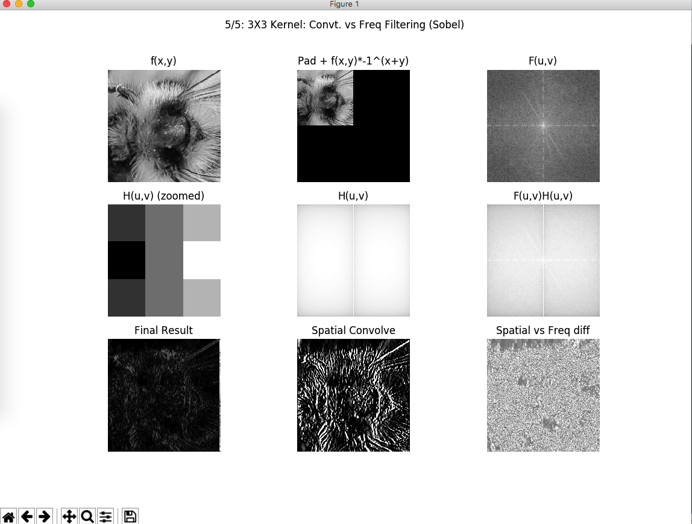

# Comparing Spatial Kernel Convolution to Frequency Domain Filtering
 
 * Gaussian HPF/LPF
 * Laplacian of Gaussian
 * Difference of Gaussians
 * Notch Filter
 * Spatial Kernel to Frequency Kernel (Sobel-x and Gaussian) 
 

